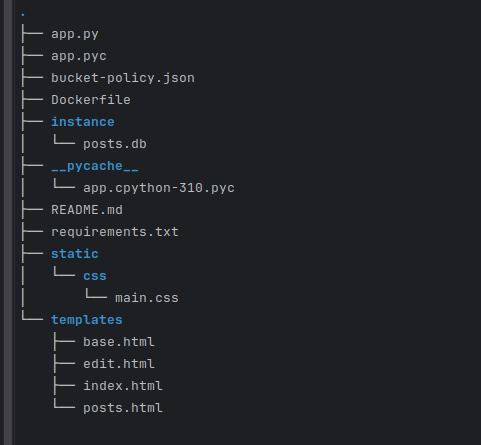

# Blog Post Application

A simple Flask-based blog application where users can view all posts, upload new posts with cover images, edit existing posts, and delete posts. The application uses **Amazon S3** for storing cover images and **MySQL (RDS)** for storing blog post data. The frontend is built using **Bootstrap** for a clean and responsive design.

---

## Features

- **View All Posts**: Users can browse all blog posts on the homepage.
- **Upload New Posts**: Authenticated users can create new blog posts with a title, content, author name, and optional cover image.
- **Edit Existing Posts**: Users can modify the title, content, author, or cover image of their posts.
- **Delete Posts**: Users can delete unwanted posts.
- **Cover Image Uploads**: Cover images are uploaded to an **Amazon S3 bucket** and displayed alongside posts.
- **Responsive Design**: Built with **Bootstrap**, ensuring the app looks great on all devices.

---

## Tools and Technologies Used

### Backend
- **Flask**: A lightweight Python web framework for building the backend.
- **SQLAlchemy**: An ORM for interacting with MySQL (RDS) database.
- **boto3**: AWS SDK for Python to interact with Amazon S3 for uploading cover images.
- **dotenv**: For managing environment variables securely.

### Frontend
- **Bootstrap**: A CSS framework for building responsive and clean UI components.
- **HTML/CSS/JavaScript**: For structuring and styling the frontend.

### Infrastructure
- **Amazon RDS**: Hosts the MySQL database for storing blog posts.
- **Amazon S3**: Stores cover images for blog posts.
- **Docker**: Containerizes the application for easy deployment.
- **Terraform**: Infrastructure as Code (IaC) tool used to provision AWS resources (RDS, S3, EC2).

---

## Project Structure




---

## Setup Instructions

### Prerequisites

1. **Python 3.10+**: Ensure Python is installed on your machine.
2. **AWS Account**: Required for setting up S3 and RDS.
3. **MySQL**: For local development, you can use a local MySQL instance or SQLite.
4. **Docker**: For containerizing the application (optional for local development).
5. **Terraform**: For provisioning AWS infrastructure (optional for local development).

---

### Installation

1. **Clone the Repository**
   ```bash
   git clone https://github.com/gideon-tee/blogApp-flask.git
   cd blogApp-flask
   ```
2. **Set up virtual environment**
    ```bash
    python3 -m venv venv
    source venv/bin/activate  # On Windows: venv\Scripts\activate
    ```
3. **Install dependencies**
    ```bash 
   pip install -r requirements.txt
   ```
   
4. **Create a .env file in the root of the directory**
    ```env
    MYSQL_USER=your-mysql-username
    MYSQL_PASSWORD=your-mysql-password
    MYSQL_HOST=localhost  # Replace with RDS endpoint in production
    MYSQL_DB=blog         # Database name
    AWS_ACCESS_KEY=your-aws-access-key
    AWS_SECRET_KEY=your-aws-secret-key
    S3_BUCKET_NAME=your-s3-bucket-name
    AWS_REGION=your-aws-region 
   ```
   
5. **Run the flask development server**
   ```bash 
   flask run
   ```
   Access the page on your localhost `http://127.0.0.1:5000`
---
### For Deployment or docker packaging
1. **Build the docker image**
   ```bash
   docker build -t blog-post-app .
   ```
   
2. **Run the container and pass the env variables at runtime**
   ```bash
   docker run -d \
     -e MYSQL_USER=your-mysql-username \
     -e MYSQL_PASSWORD=your-mysql-password \
     -e MYSQL_HOST=your-rds-endpoint \
     -e MYSQL_DB=blog \
     -e AWS_ACCESS_KEY=your-aws-access-key \
     -e AWS_SECRET_KEY=your-aws-secret-key \
     -e S3_BUCKET_NAME=your-s3-bucket-name \
     -e AWS_REGION=your-aws-region \
     -p 5000:5000 \
     blog-post-app
   ```

3. **To deploy to AWS make sure to provision the resources (Terraform was used in this case)**
   
   
